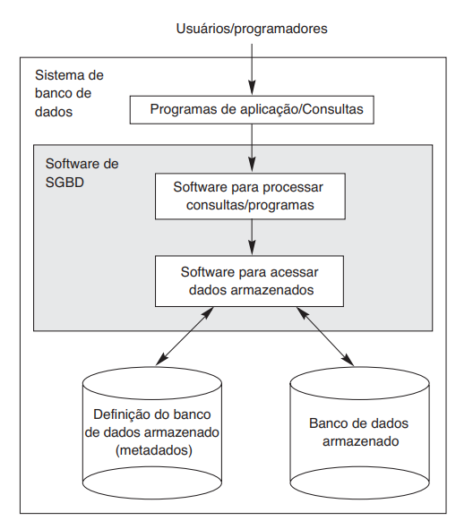
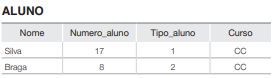
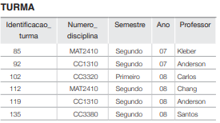
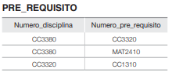
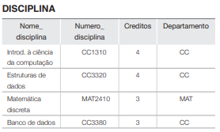
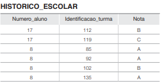

#  Introdução a Banco de Dados

---

### Por que estudar banco de dados

</br>

- Bancos de dados e sistemas de banco de dados são componentes essenciais da sociedade moderna.

</br>

- No cotidiano, muitas atividades dependem de banco de dados, mesmo quando isso não é visível para o usuário.

---

### Exemplos do dia a dia

</br>


- Operações bancárias: depósito, saque e transferências
- Reservas de hotel e compra de passagens
- Busca em catálogo de bibliotecas
- Compras on-line (livros, eletrônicos, serviços)
- Supermercados: atualização automática de estoque

---

### Aplicações tradicionais de banco de dados

</br>

- Predominância de dados textuais e numéricos
- Cadastro de clientes, produtos e serviços
- Registro de transações comerciais
- Geração de relatórios operacionais

Essas aplicações formam a base dos sistemas de informação em empresas e instituições.

---

### Aplicações modernas

</br>

- Bancos de dados multimídia:
  armazenamento de imagens, áudio e vídeo
- GIS (Sistemas de Informação Geográfica):
  mapas, dados climáticos e imagens de satélite
- Data warehousing e processamento analítico online (OLAP — On-Line Analytical Processing):
  análise de grandes volumes de dados para decisão

---

### Banco de dados em tempo real e na Web


</br>

- Bancos de dados ativos e em tempo real:
  controle de processos industriais e manufatura
- Técnicas de busca e organização na Web:
  melhoria na recuperação de informação para usuários

---

### Impacto de Banco de dados

</br>

- Os bancos de dados e sua tecnologia têm um impacto importante sobre o uso crescente dos computadores. 

- É correto afirmar que os bancos de dados
desempenham um papel crítico em quase todas as
áreas em que os computadores são usados, incluindo
negócios, comércio eletrônico, engenharia, medicina,
genética, direito, educação e biblioteconomia. 

- O termo banco de dados (do original database) é tão utilizado que precisamos começar por sua definição. E nossa definição inicial é bastante genérica.

---

### Banco de dados relacionados

</br>

Um banco de dados é uma coleção de dados relacionados. Com dados, queremos dizer fatos
conhecidos que podem ser registrados e possuem significado implícito. 

- Por exemplo, considere os nomes,
números de telefone e endereços das pessoas que
você conhece. Você pode ter registrado esses dados
em uma agenda ou, talvez, os tenha armazenado em
um disco rígido, usando um computador pessoal
ou uma planilha Excel. Isso é um banco de dados.

---

### uso prático de banco de dados 

</br>

No uso prático, banco de dados é mais do que um conjunto qualquer de dados. Ele deve:

- representar um cenário real e delimitado, como matrícula de alunos, prontuário hospitalar ou vendas de uma loja;
- estruturar os dados com regras claras (tabelas, chaves e relacionamentos), por exemplo: Aluno, Disciplina e Matrícula ligados por identificadores;
- atender um objetivo específico, como emitir boletins, controlar estoque, gerar relatórios gerenciais e apoiar decisões.

---

### características de um banco de dados 

</br>

- Um banco de dados precisa ser atualizado com rapidez para refletir mudanças reais e manter confiabilidade.

- Os bancos de dados variam muito em tamanho e complexidade: podem ir de pequenas listas até sistemas gigantes, como Receita Federal e plataformas de e-commerce (ex.: Amazon), com alto volume de dados e acessos diários.

- Por fim, podem ser mantidos manualmente ou por computador; na disciplina, o foco é em bancos de dados computadorizados e em sistemas gerenciadores de banco de dados (SGBD).

---

### Sistema gerenciador de banco de dados

</br>

- Um sistema gerenciador de banco de dados (SGBD — Database Management System) é uma coleção de programas que permite aos usuários criar e manter um banco de dados. 

</br>

- O SGBD é um sistema de software de uso geral que facilita o processo de definição, construção, manipulação e compartilhamento de bancos de dados entre diversos usuários e
aplicações

---

## o que o SGBD faz

</br>

1. **Definição do banco de dados**
  Especifica tipos de dados, estruturas (tabelas/relacionamentos) e restrições (regras de integridade).

2. **Metadados (catálogo/dicionário de dados)**
  Armazena descrições do banco de dados para orientar validação, organização e uso dos dados.

3. **Construção do banco de dados**
  Realiza o armazenamento dos dados em mídia controlada pelo SGBD.

4. **Manipulação de dados**
  Permite consultar dados, atualizar informações para refletir mudanças no minimundo e gerar relatórios.

5. **Compartilhamento**
  Suporta acesso simultâneo por múltiplos usuários e aplicações, com controle e consistência.

---

### Principais SGBDs do mercado 

</br>

```{=html}
<div style="display:grid; grid-template-columns: repeat(3, 1fr); gap:18px; margin-top:12px;">

  <div style="background:#f8fafc; border:1px solid #dbe5f1; border-radius:14px; padding:14px; text-align:center;">
    
    <div style="margin-top:8px; font-weight:600; color:#23395b;">PostgreSQL</div>
  </div>

  <div style="background:#f8fafc; border:1px solid #dbe5f1; border-radius:14px; padding:14px; text-align:center;">
    
    <div style="margin-top:8px; font-weight:600; color:#23395b;">MySQL</div>
  </div>

  <div style="background:#f8fafc; border:1px solid #dbe5f1; border-radius:14px; padding:14px; text-align:center;">
    
    <div style="margin-top:8px; font-weight:600; color:#23395b;">SQLite</div>
  </div>

  <div style="background:#f8fafc; border:1px solid #dbe5f1; border-radius:14px; padding:14px; text-align:center;">
    
    <div style="margin-top:8px; font-weight:600; color:#23395b;">Oracle Database</div>
  </div>

  <div style="background:#f8fafc; border:1px solid #dbe5f1; border-radius:14px; padding:14px; text-align:center;">
    
    <div style="margin-top:8px; font-weight:600; color:#23395b;">SQL Server</div>
  </div>

  <div style="background:#f8fafc; border:1px solid #dbe5f1; border-radius:14px; padding:14px; text-align:center;">
    
    <div style="margin-top:8px; font-weight:600; color:#23395b;">MongoDB</div>
  </div>

  <div style="background:#f8fafc; border:1px solid #dbe5f1; border-radius:14px; padding:14px; text-align:center;">
    
    <div style="margin-top:8px; font-weight:600; color:#23395b;">Cassandra</div>
  </div>

  <div style="background:#f8fafc; border:1px solid #bec7d2; border-radius:14px; padding:14px; text-align:center;">
    
    <div style="margin-top:8px; font-weight:600; color:#23395b;">Hive</div>
  </div>

  <div style="background:#f8fafc; border:1px solid #dbe5f1; border-radius:14px; padding:14px; text-align:center;">
    
    <div style="margin-top:8px; font-weight:600; color:#23395b;">Db2</div>
  </div>

</div>
```

---

### Como aplicações usam o SGBD

</br>

- Aplicações acessam o banco por meio de consultas e transações.
- Consultas recuperam dados; transações leem e gravam informações.
- O SGBD também oferece proteção contra falhas e controle de segurança.
- Como bancos de dados têm ciclo de vida longo, o SGBD precisa sustentar manutenção e evolução contínuas.
- É possível criar um sistema próprio, mas isso exige muito software complexo; por isso, na prática, usa-se SGBD de mercado.

---

### Sistema de banco de dados 


</br>

:::: {.columns}

::: {.column width="40%"}

</br>


</br>

::: {style="background: rgba(78, 93, 181, 0.1); backdrop-filter: blur(10px); border-radius: 10px; padding: 10px; border: 1px solid rgba(100, 87, 108, 0.3);"}

Para completar nossas definições iniciais,
chamaremos a união do banco de dados com o
software de SGBD de sistema de banco de dados. 

:::

:::

::: {.column width="60%"}

{width="70%" height="auto"}


:::

::::

---

#### Exemplo : Banco de dados para manter informações referentes a alunos, disciplinas e notas em um ambiente universitário (UEPB). 

:::: {.columns}

::: {.column width="50%"}

{width="70%" height="auto"}


{width="70%" height="auto"}

{width="70%" height="auto"}

:::


::: {.column width="50%"}

{width="70%" height="auto"}


{width="70%" height="auto"}


:::

::::

---

### Definição do banco de dados UNIVERSIDADE

</br>

Para definir o banco UNIVERSIDADE, precisamos modelar:

- a estrutura de cada registro (campos);
- os tipos de dados de cada campo;
- regras de codificação para valores específicos.

---

### Exemplo de estrutura dos registros

- ALUNO: Nome, Numero_aluno, Tipo_aluno, Curso.
- DISCIPLINA: Nome_disciplina, Numero_disciplina, Creditos, Departamento.
- HISTORICO_ESCOLAR: registro das notas por turma/disciplina.

Cada entidade gera um conjunto de registros com formato definido.

---

### Tipos de dados e codificação

- Nome: sequência de caracteres.
- Numero_aluno: número inteiro.
- Nota: valor do conjunto {A, B, C, D, F}.
- Tipo_aluno (codificação):
  1 = novato, 2 = segundo ano, 3 = júnior, 4 = sênior, 5 = formado.

Definir tipos e códigos evita ambiguidades e melhora validação dos dados.

---

### Construção do banco UNIVERSIDADE

Na etapa de construção, os dados são armazenados em arquivos/tabelas apropriados:

- ALUNO
- DISCIPLINA
- TURMA
- HISTORICO_ESCOLAR
- PRE_REQUISITO

---

### Relacionamentos entre registros

- Registros de arquivos diferentes se conectam entre si.
- Exemplo: um aluno (Silva) pode estar ligado a vários registros no HISTORICO_ESCOLAR.
- Exemplo: PRE_REQUISITO conecta uma disciplina à sua disciplina pré-requisito.

Em bancos médios e grandes, há muitos tipos de registros e muitos relacionamentos simultâneos.


---

### Manipulação do banco de dados

A manipulação envolve duas operações principais:

- **Consulta:** recuperar informações armazenadas.
- **Atualização:** inserir, alterar ou remover dados para refletir mudanças no minimundo.

As solicitações são inicialmente descritas pelo usuário e depois traduzidas para a linguagem de consulta do SGBD.

---

### Exemplos de consultas

No banco UNIVERSIDADE, podemos solicitar:

- todas as disciplinas e notas de Silva;
- alunos que cursaram Banco de Dados no segundo semestre de 2008 e suas notas;
- os pré-requisitos da disciplina Banco de Dados.

O SGBD interpreta a solicitação e retorna apenas os dados correspondentes.

---

### Exemplos de atualizações

Também podemos modificar o banco para representar novos eventos:

- alterar o tipo de aluno de Silva para segundo ano;
- criar uma nova turma de Banco de Dados;
- inserir a nota A de Silva na turma do último semestre.

Cada alteração deve respeitar os tipos de dados e as regras de integridade do banco.

---

### Banco de dados como sistema de informação

Um sistema de informação reúne:

- computadores e sistemas de armazenamento;
- softwares de aplicação;
- bancos de dados;
- usuários e processos organizacionais.

O desenvolvimento de uma nova aplicação começa com a **especificação e análise de requisitos**. Os requisitos são documentados, transformados em um projeto conceitual e, posteriormente, implementados no banco de dados.

---

# Características da abordagem de banco de dados

---

### abordagem baseada em SGBD

Uma abordagem baseada em SGBD se diferencia do processamento tradicional de arquivos porque oferece recursos para:

- descrever os próprios dados;
- separar programas da estrutura de armazenamento;
- oferecer diferentes visões para diferentes usuários;
- compartilhar dados com segurança e controle de concorrência.

Essas características permitem que várias aplicações usem uma fonte comum de dados.

---

### Natureza de autodescrição

O SGBD mantém, além dos dados, um catálogo com informações sobre o banco:

- nomes de tabelas, campos e relacionamentos;
- tipos e domínios dos dados;
- restrições de integridade;
- usuários, permissões e visões;
- estruturas de armazenamento e índices.

Esse catálogo contém os **metadados**, isto é, dados sobre os dados.

---

### Exemplo de metadados no banco UNIVERSIDADE

O catálogo pode registrar que:

- `Numero_aluno` é um identificador inteiro;
- `Nome` armazena texto;
- `Tipo_aluno` possui valores codificados;
- `Numero_disciplina` identifica uma disciplina;
- `HISTORICO_ESCOLAR` relaciona alunos e turmas.

Com essas informações, o SGBD consegue validar operações e interpretar consultas sem depender de regras escondidas em cada programa.

---

### Isolamento entre programas e dados

No processamento tradicional de arquivos, a estrutura dos dados costuma estar escrita dentro dos programas.

Se o formato do arquivo muda, vários programas precisam ser alterados.

No SGBD, os programas consultam a estrutura descrita no catálogo. Assim, mudanças na organização interna podem ser feitas sem alterar todas as aplicações.

---

### Abstração de dados

O usuário trabalha com conceitos próximos do problema, como:

- aluno;
- disciplina;
- turma;
- nota.

Ele não precisa conhecer a posição física de cada campo no disco, o formato das páginas ou os índices usados pelo SGBD.

Essa separação entre visão lógica e armazenamento físico é chamada de **abstração de dados**.

---

### Suporte a múltiplas visões

Um mesmo banco pode oferecer visões diferentes para grupos diferentes.

No banco UNIVERSIDADE:

- a secretaria pode visualizar matrícula e histórico;
- o professor pode visualizar suas turmas e notas;
- o aluno pode visualizar seu próprio histórico;
- a coordenação pode visualizar indicadores do curso.

As visões mostram somente os dados necessários para cada atividade.

---

### Compartilhamento e processamento multiusuário

Um SGBD permite que muitos usuários acessem o banco ao mesmo tempo.

Para isso, ele controla:

- quem pode ler ou modificar cada dado;
- operações simultâneas sobre os mesmos registros;
- conflitos entre atualizações;
- consistência do banco após cada operação.

O compartilhamento reduz a duplicação de dados e melhora a integração entre setores.

---

### Transações

Uma transação é um conjunto de operações que deve ser executado de forma logicamente correta.

Exemplo: registrar a matrícula de um aluno pode envolver:

1. verificar se a turma existe;
2. verificar se há vaga;
3. inserir a matrícula;
4. atualizar a quantidade de vagas.

Se uma etapa falhar, o SGBD pode desfazer o conjunto para evitar um estado incompleto.

---

# Atores em cena

---

### principais atores

Em um banco pequeno, uma mesma pessoa pode criar e usar o banco. Em organizações maiores, diferentes papéis participam do projeto e da operação.

Os principais atores são:

- administradores de banco de dados;
- projetistas de banco de dados;
- usuários finais;
- analistas de sistemas e programadores de aplicações.

---

### Administrador de banco de dados

O administrador de banco de dados, ou **DBA**, supervisiona os recursos do banco.

Suas responsabilidades incluem:

- definir usuários e privilégios;
- monitorar desempenho e disponibilidade;
- gerenciar backup e recuperação;
- acompanhar o uso do armazenamento;
- aplicar políticas de segurança;
- coordenar mudanças no banco.

No banco UNIVERSIDADE, o DBA controla o acesso de secretaria, professores, alunos e coordenação.

---

### Projetista de banco de dados

O projetista transforma os requisitos do negócio em uma estrutura de dados.

Ele define:

- entidades, atributos e relacionamentos;
- tabelas, chaves e domínios;
- restrições de integridade;
- visões adequadas aos grupos de usuários.

Para o banco UNIVERSIDADE, o projetista decide como representar `ALUNO`, `DISCIPLINA`, `TURMA` e `HISTORICO_ESCOLAR`.

---

### Usuários finais

Usuários finais acessam o banco para consultar, inserir, atualizar ou gerar relatórios.

Podem ser:

- **paramétricos:** executam operações já preparadas, como registrar matrícula;
- **casuais:** fazem consultas específicas, como um relatório gerencial;
- **especializados:** usam ferramentas para análise, pesquisa ou modelagem.

Cada perfil deve receber apenas as permissões necessárias para sua função.

---

### Analistas e programadores de aplicações

Esses profissionais:

- levantam requisitos com os usuários;
- projetam telas e fluxos de trabalho;
- escrevem programas que acessam o SGBD;
- criam consultas, relatórios e transações;
- testam o comportamento da aplicação.

Eles conectam as necessidades do usuário às estruturas e serviços oferecidos pelo banco.

---

# Trabalhadores dos bastidores

---

### infraestrutura

Além de quem projeta e utiliza o banco, existem profissionais responsáveis pelo software e pela infraestrutura.

Entre eles estão:

- projetistas e implementadores do SGBD;
- desenvolvedores de ferramentas;
- operadores e profissionais de manutenção;
- especialistas em armazenamento, redes e sistemas.

Esses trabalhadores normalmente não aparecem na rotina dos usuários, mas sustentam o funcionamento do sistema.

---

### Projetistas e implementadores do SGBD

São responsáveis por desenvolver os componentes internos do SGBD, como:

- gerenciador de armazenamento;
- processador e otimizador de consultas;
- controle de transações e concorrência;
- segurança e autorização;
- backup e recuperação;
- catálogo e gerenciamento de metadados.

Seu trabalho permite que o SGBD ofereça uma interface confiável para as aplicações.

---

### Desenvolvedores de ferramentas

Criam ferramentas que facilitam o trabalho com o banco, como:

- editores de consultas;
- geradores de relatórios;
- ferramentas de modelagem;
- painéis de monitoramento;
- interfaces de administração;
- utilitários de migração e integração.

Essas ferramentas tornam os recursos do SGBD mais acessíveis a diferentes perfis de usuário.

---

### Operadores e profissionais de manutenção

Garantem a operação cotidiana do ambiente:

- acompanham servidores e serviços;
- executam rotinas de cópia de segurança;
- verificam espaço e desempenho;
- aplicam atualizações;
- restauram serviços após falhas;
- documentam procedimentos operacionais.

A disponibilidade do banco depende tanto do software quanto dessa rotina de manutenção.

---

## Vantagens de usar a abordagem de SGBD

O uso de um SGBD oferece benefícios que vão além do armazenamento:

- controle da redundância;
- restrição de acesso não autorizado;
- armazenamento persistente;
- estruturas de pesquisa eficientes;
- backup e recuperação;
- múltiplas interfaces;
- representação de relacionamentos complexos;
- imposição de integridade;
- suporte a dedução e ações automáticas.

---

### Controle da redundância

Quando cada setor mantém seus próprios arquivos, o mesmo dado pode ser armazenado várias vezes.

Isso pode causar:

- desperdício de espaço;
- atualizações repetidas;
- valores divergentes;
- dificuldade para identificar qual cópia está correta.

No banco UNIVERSIDADE, o nome do aluno deve ser mantido de forma centralizada, em vez de ser repetido com possibilidade de divergência no histórico.

---

### Restrição de acesso não autorizado

O SGBD pode controlar o acesso por meio de:

- contas de usuário;
- senhas e autenticação;
- papéis e privilégios;
- visões restritas;
- registro de operações.

Um aluno pode consultar seu histórico, enquanto a secretaria pode registrar matrículas e a coordenação pode consultar dados agregados.

---

### Armazenamento persistente

Os dados permanecem disponíveis depois que uma aplicação é encerrada.

Essa persistência permite que:

- uma matrícula seja consultada posteriormente;
- um histórico atravesse vários semestres;
- diferentes aplicações usem os mesmos dados;
- informações sejam compartilhadas ao longo do tempo.

O SGBD gerencia a gravação e a recuperação dos dados em armazenamento não volátil.

---

### Estruturas de armazenamento e pesquisa

Para encontrar dados com eficiência, o SGBD pode utilizar:

- índices;
- árvores de pesquisa;
- tabelas de hash;
- buffers e cache;
- estratégias de otimização de consultas.

Assim, uma consulta por `Numero_aluno` não precisa examinar todos os registros de `ALUNO`.

---

### Backup e recuperação

Falhas de hardware, software ou energia podem interromper uma operação.

O SGBD oferece mecanismos para:

- manter cópias de segurança;
- registrar alterações;
- desfazer operações incompletas;
- restaurar o banco a um estado consistente.

No banco UNIVERSIDADE, esses recursos protegem históricos, matrículas e notas contra perda ou corrupção.

---

### Múltiplas interfaces de usuário

O mesmo banco pode ser acessado por:

- aplicações web;
- sistemas de secretaria;
- aplicativos móveis;
- consultas SQL;
- painéis gerenciais;
- rotinas automatizadas.

As interfaces mudam, mas o SGBD mantém uma fonte comum e controlada de dados.

---

### Relacionamentos complexos e integridade

Um banco pode representar relações entre muitos tipos de dados.

No exemplo da universidade:

- alunos se matriculam em turmas;
- turmas pertencem a disciplinas;
- disciplinas podem exigir pré-requisitos;
- históricos registram notas.

O SGBD também impõe regras para evitar referências inexistentes, chaves duplicadas e valores inválidos.

---

### Dedução e ações usando regras

Alguns sistemas permitem definir regras para derivar informações ou disparar ações.

Exemplos:

- calcular automaticamente a situação acadêmica;
- sinalizar aluno com pré-requisito pendente;
- atualizar um indicador após o lançamento de uma nota;
- gerar um alerta quando uma condição for atingida.

Esses recursos ampliam o papel do banco como parte ativa do sistema de informação.

---

### Implicações adicionais

A abordagem de SGBD também favorece:

- padronização de nomes, formatos e procedimentos;
- flexibilidade para novas aplicações;
- redução do tempo de desenvolvimento;
- disponibilidade de informações atualizadas;
- redução de custos pela integração de dados e sistemas.

Essas vantagens aparecem especialmente quando muitos setores dependem das mesmas informações.

---

### Atividade

Considere o banco UNIVERSIDADE e responda:

1. Que metadados o catálogo deveria armazenar para `ALUNO`?
2. Qual visão seria adequada para um aluno e qual seria adequada para a secretaria?
3. Dê um exemplo de redundância e explique como controlá-la.
4. Qual profissional seria responsável por definir as permissões de acesso?
5. Por que backup e recuperação são importantes para o histórico escolar?